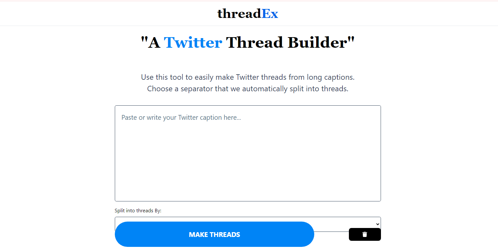

<h1 align="center">
threadEx</h1>

<h2>

[🚀Live Site]() || devjhex

</h2>

<!-- Badges -->

    

<!-- License -->

This is a web application that showcases the functionality of a thread builder for users to easily create threads in an efficient and fast way.

## Tech Stack
- Vanilla JavaScript for application logic and event handling.
- Tailwind for styling of the markup.
- HTML for markup.

